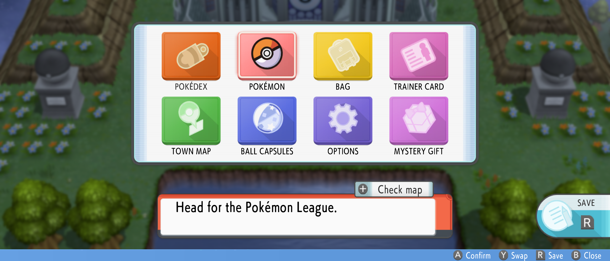
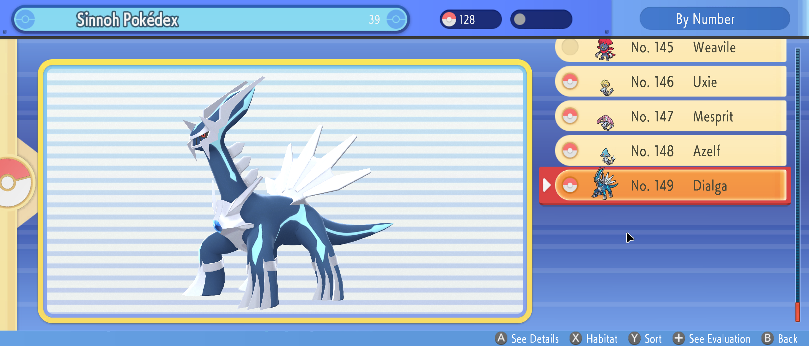
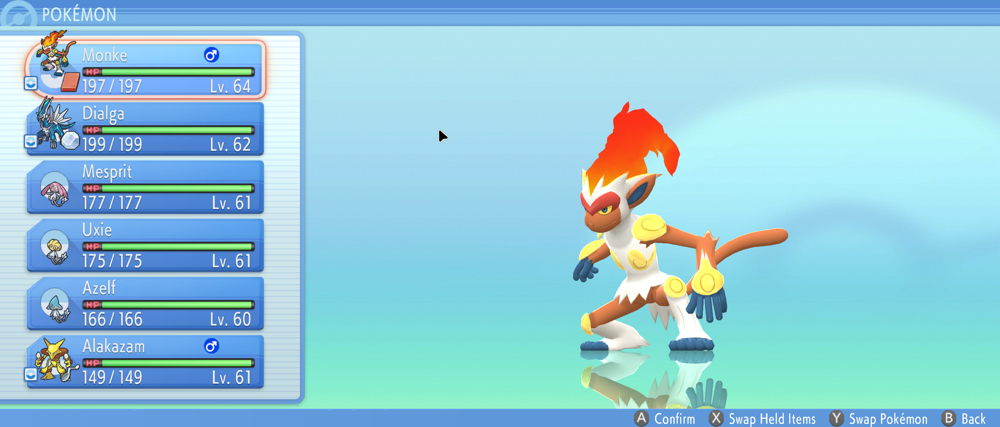
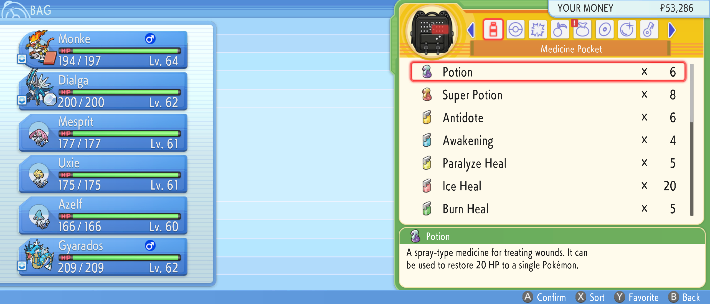
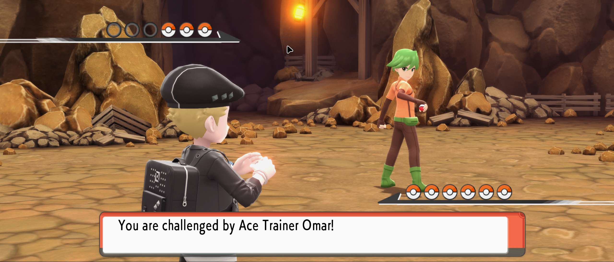
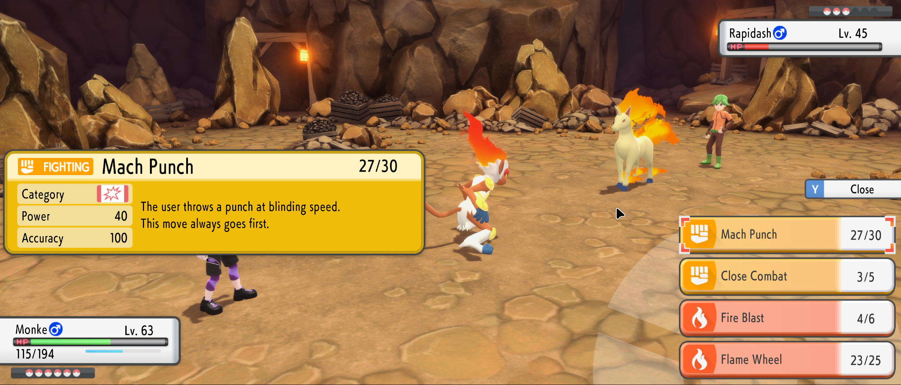
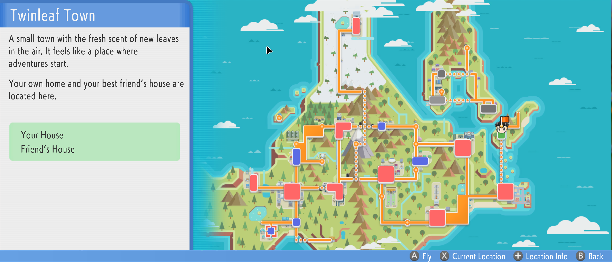

# True Ultrawide UI 3440x1440 21:9

For Pokémon Brilliant Diamond 1.3.0 at 3440×1440, tested locally in Eden.

## Previews

| Main menu | Pokédex |
| --- | --- |
|  |  |
| Party | Bag |
|  |  |
| Battle intro | Battle menu |
|  |  |
| Town map | |
|  | |

## Credits

The original ultrawide ExeFS patch is by
[Fl4sh_#9174 (Fl4sh9174)](https://github.com/Fl4sh9174), from the
[Brilliant Diamond mod archive](https://github.com/Fl4sh9174/Switch-Emulator-Ultrawide-FPS-Mods/blob/main/Pokemon%20Brilliant%20Diamond%20%5B0100000011D90000%5D%5Bmods%5D.zip).
This project adds UI asset patches, further native fixes, and build tools.
See [source attribution](ATTRIBUTION.md) for the exact upstream file and
verified revision. Attribution is included in the generated mod.

## Implemented

- The upstream ultrawide ExeFS patch is included in the build.
- Menus, backgrounds, and battle UI extend across the wider viewport.
- Pokétch positioning, scaling, and touch controls follow the displayed screen.
- Pokédex previews, Motion/Cry, and Habitat layouts use the wider viewport.
- Capsule selection, previews, and sticker placement are aligned in 2D and 3D.
- Encounter transitions and Hidden Move backdrops cover the full width.

## Development

### Install the dumps and keys

Use the shared [development setup](../README.md#development). You need Nix
with flakes enabled, your own Brilliant Diamond base-game NSP and v1.3.0 update
NSP, and your own keys capable of decrypting both dumps. Place them at the
repository root with these exact filenames:

```text
dumps/
├── base.nsp
├── update.nsp
└── prod.keys
```

From the repository root, enter the development shell and create the merged
extraction:

```sh
nix develop
just setup
just extract
```

### Build and install

Run these commands from the repository root, inside the development shell:

```sh
just build-ultrawide
just install-ultrawide
```

The build patches the original UI assets and includes
`ultrawide-v1.3.0.pchtxt`, then writes the generated mod to `dist/True Ultrawide UI 3440x1440 21:9/`.
Installation copies it to `~/.local/share/eden/load/0100000011D90000/True Ultrawide UI 3440x1440 21:9/`.
Restart the game after installing. Enable **stretch to window** and the
**8 GB RAM layout** in Eden. Enable this mod on its own; the upstream
ultrawide patch is already included.

The build targets title `0100000011D90000`, build
`94CEAE325C205C4B9D6F7235552F28FD`.

Use `just check` to syntax-check the maintained Python scripts and `just audit-ultrawide`
to inspect the generated UI bundles. Audit reports are written to temporary
directories; each command prints its output path.

### Android installation

With an Android device connected through ADB, run:

```sh
adb devices
just push-ultrawide
```

This installs the built mod under `/sdcard/Android/data/dev.eden.eden_emulator.nightly/files/load/0100000011D90000/True Ultrawide UI 3440x1440 21:9/`.
Use `just capture` to save a screenshot to a temporary directory.
